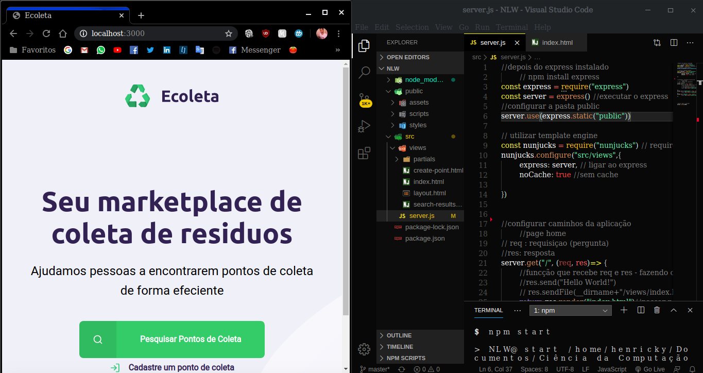

# nextlevelweek
Participação no evento nextLevelWeek da rocketseat que consiste em uma semana de estudo intensivo na área de desenvolvimento Web.

# Day 4

Neste dia trabalhamos com o BackEnd onde organizamos nossas pastas para começar a codificar (Sistema Full MVC - front e back na mesma aplicação) 

-- em construção --

Como haviam muitas informações, aqui estão as notas de aula:

* instalação dos módulos
    -   trabalhamos o npm (node package manager) - npm init -y
cria um arquivo .json(JS object notation) que "transforma" nossa pasta em um projeto.
    - npm install express
    - npm install nodemon -D (modulo de monitoramento -  dependencia de desenvolvimento)
    - Precisou-se fazer com que o express veja a pasta public
faz com que não seje necessário reiniciar o servidor quando fizer uma alteração

* Condiguração do servidor
* Rotas da aplicação
* Template e Engine
    - dar poder ao html (marcação) para ter funcionalidades como if e for.
* Dados

* [ BackEnd ](https://www.notion.so/Back-end-a5747fd6bfa34e799e6e0ded51f5ec63)

[ Obs ] Os arquivos do dia 3 fora copiados para o dia 4 e continuados de lá.
