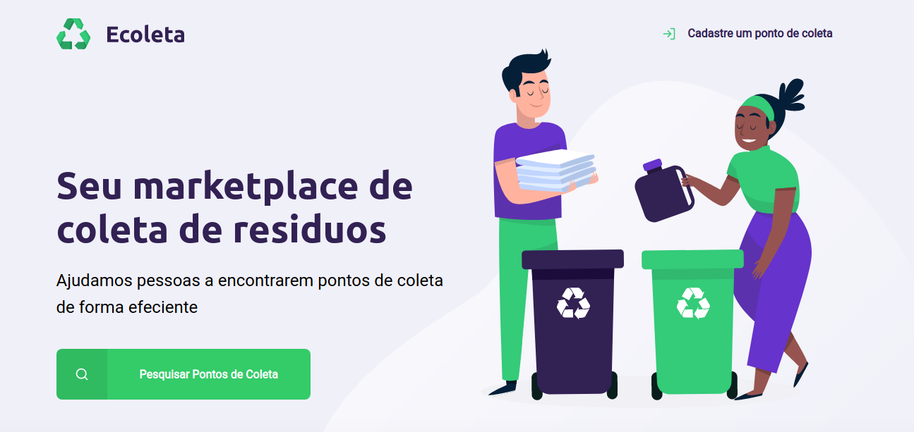

# Next Level Week
Participação no evento nextLevelWeek da rocketseat que consiste em uma semana de estudo intensivo na área de desenvolvimento Web.

# Dia 1

Neste dia foi implementada a página Home do projeto Ecoleta, um site que gerencia pontos de coleta de material reciclado.

Trabalhou-se 2 dos  pilares do desenvolvimento web: HTML e CSS

* [FrontEnd](https://www.notion.so/Front-end-7c8a1a9a6df547058f1473f899a3b9c4)
