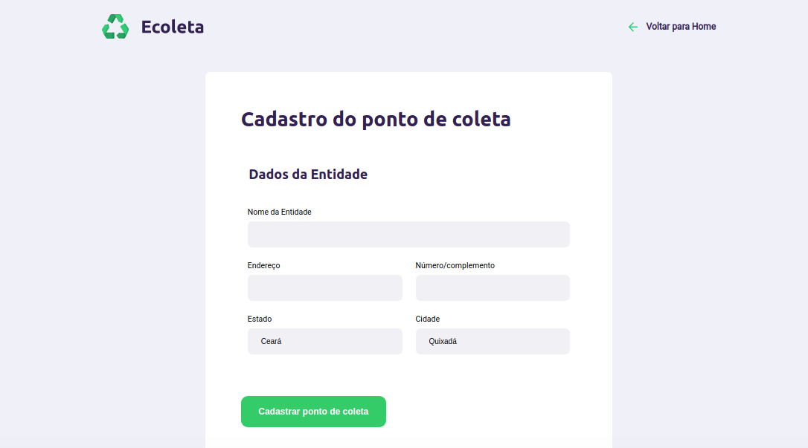

# nextlevelweek
Participação no evento nextLevelWeek da rocketseat que consiste em uma semana de estudo intensivo na área de desenvolvimento Web.

# Day 2
Fazer a página de cadastro dos pontos de coleta 

* Refatarondo o código do dia anterior, ou seja, fazer ajustes para melhorar as manutenções futuras
* Trabalhando com responsividade
* Fazendo a página de cadastro
* Utilizando o JS para fazer uma página de cadastro

[ Obs ] Os arquivos do dia 1 fora copiados para o dia 2 e continuados de lá.
