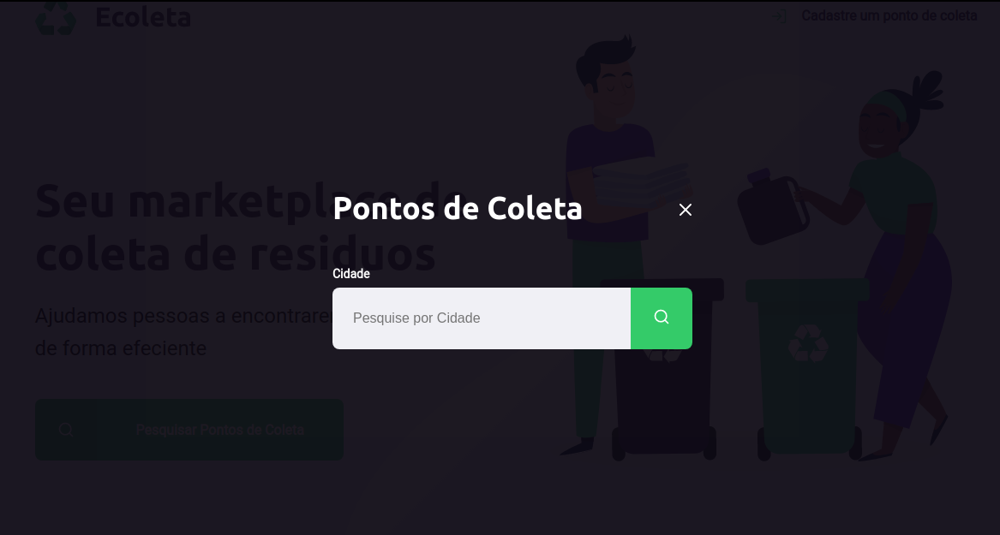
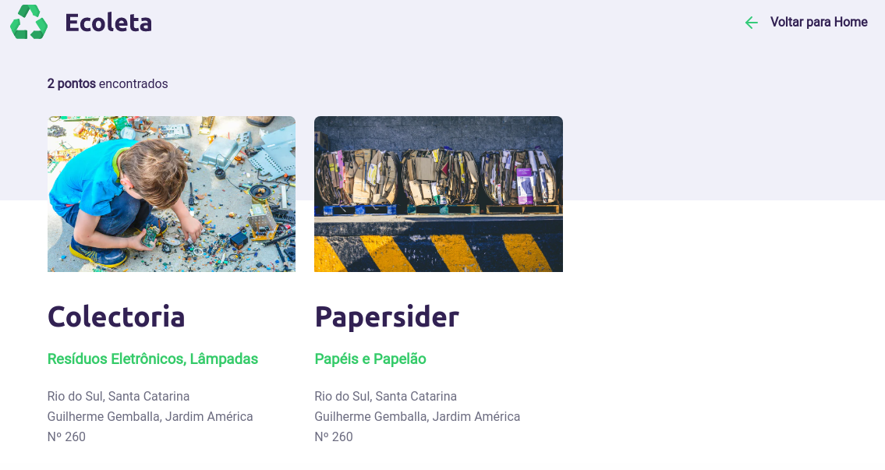

# nextlevelweek
Participação no evento nextLevelWeek da rocketseat que consiste em uma semana de estudo intensivo na área de desenvolvimento Web.

# Day 3
Neste dia fizemos a página de pesquisa de pontos de coleta (sobre a página home) e a página de resultados de pesquisa.

Utilizamos algumas funcionalidades do JavaScript para trabalhar com "mostrar/esconder" da página de pesquisa.

[ Obs ] Os arquivos do dia 2 fora copiados para o dia 3 e continuados de lá.
